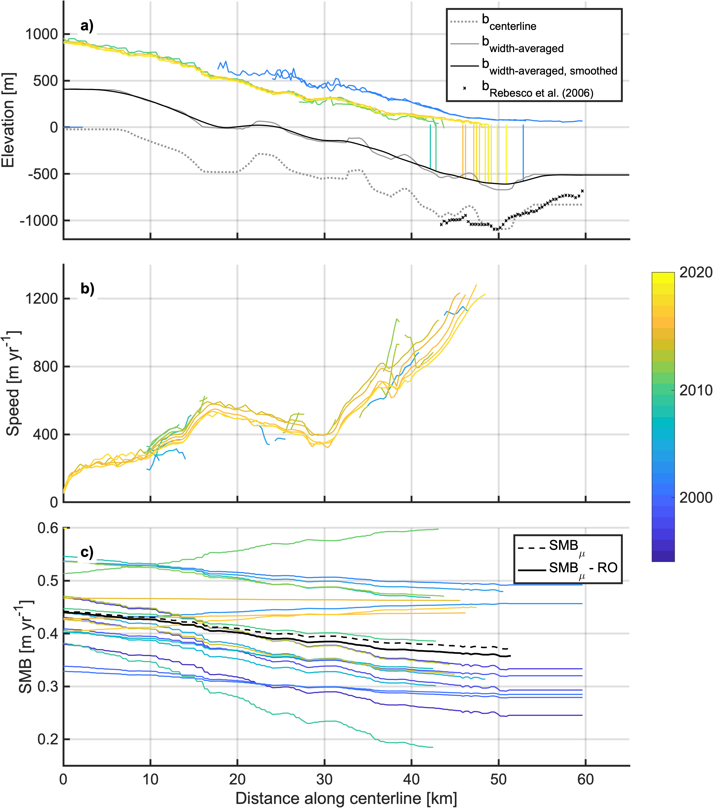

# Crane Glacier flowline modeling 

Code package used to model Crane Glacier response to the 2002 Larsen B ice shelf collapse and sensitivities to future changes in climate

Rainey Aberle and Ellyn Enderlin

_Estimated conditions along the glacier centerline (1994-2018):_

_Modeling results under unchanging climate conditions with varying fresh water depth in crevasses (d_fw) and climate perturbations for surface mass balance (SMB) and ocean thermal forcing (F_T) (1994-2100):_

---

### Correspondence

Rainey Aberle (raineyaberle@u.boisestate.edu)

---

### Workflows:

- `steady-state-initial`: tune the model by simulating the pre-ice shelf collapse conditions until reaching a steady state criterion, the ice shelf collapse (remove all back stress), and run the model forward until 2100 with a range of future climate conditions.  
- `dynamic-initial-UNTESTED`: (not recommended) tune the model to produce post-collapse conditions 2009-2018, then run the model forward until 2100 with a range a future changes in climate conditions. 

### Order of operations:

- Synthesize observations and modeled conditions: `a_centerline_observations.m`, `b_glacier_width.mlx`, `c_downscale_RACMO.m`, `d_rate_factor.m`, `e_cumulative_strain.m`,  `f_LarsenC_melt.m`
- Save conditions to initialize model: `g_save_initialization.m`
- Run model simulations: `h_collapse_simulation.m`

### Extracted data:

To access observational data and model outputs averaged across the glacier width, see `inputs-outputs/`. 

- Centerline observations: all files with the `observed_*.mat` file name structure.
- Model outputs: all files with the `modeled_*.mat` file name structure. 
- Other:
    - `Crane_centerline.mat`: delineated glacier centerline coordinates (Antarctic polar stereographic)
    - `downscaled_RACMO_variables_2009-2019.mat`: RACMO2.3 model outputs for snowmelt, snowfall, runoff, and surface mass balance (SMB) interpolated to the glacier centerline and downscaled using statistical methods described by Noël et al. (2016)
    - `Tributary*.mat`: estimated mass flux from glacier tributaries to the main trunk
    
### Modeling results: 
See `workflows/steady-state-initial/results`.
- `1_SMB_DFW_TF`: results in model year 2100 for the range of SMB, freshwater depth in crevasses (DFW), and ocean thermal forcing (TF) perturbations applied independently.
- `2_SMB_enh`: results in model year 2100 for SMB plus surface meltwater runoff-enhanced submarine melt (SMB_enh).  
- `3_SMB_enh+TF`: results in model year 2100 for concurrent SMB_enh and TF perturbations. 

### Figures:

See `figures/` for figures used in manuscript and otherwise. 

---

### Datasets not included in this repository which are used in the workflow

Velocities:  

- NASA ITS\_LIVE (1999-2018) (Gardner et al., 2021)
- ERS-derived (1994-5) (Wuite et al., 2015)

Surface elevations:

- GTOPO30 (~1995) (Gesch et al., 1999)
- ASTER DEMs (2000-2002)
- NASA OIB L2 (2009-11, 2016-18) (Paden et al., 2010)

Terminus positions:

- Manually delineated from Landsat imagery (Dryak and Enderlin, 2020)

Bed elevation: 

- NASA OIB L1B, manually digitized bed picks using the CReSIS toolbox (Paden et al., 2014)

---

### References
Dryak, M. C., and Enderlin, E. M. (2020). Analysis of Antarctic Peninsula glacier frontal ablation rates with respect to iceberg melt-inferred variability in ocean conditions. _Journal of Glaciology_. _66_(257): 457-470. https://doi.org/10.1017/JOG.2020.21

Gardner, A. S., M. A. Fahnestock, and Scambos, T. A. (2021). MEaSUREs ITS_LIVE Landsat Image-Pair Glacier and Ice Sheet Surface Velocities: Version 1. https://doi.org/10.5067/IMR9D3PEI28U

Gesch, D. B., Verdin, K. L., and Greenlee, S. K. (1999). New land surface digital elevation model covers the Earth. _Eos Trans. AGU_. _80_(6), 69–70, https://doi.org/10.1029/99EO00050

Paden, J., Li, J., Leuschen, C., Rodriguez-Morales, F. and Hale, R. (2010). Icebridge mcords l2 ice thickness, version 1. https://doi.org/63710.5067/GDQ0CUCVTE2Q

Paden, J., Li, J., Leuschen, C., Rodriguez-Morales, F. and Hale, R. (2014). Icebridge mcords l1b geolocated radar echo639strength profiles, version 2. https://doi.org/10.5067/90S1XZRBAX5N

Noël, B., Jan Van De Berg, W., MacHguth, H., Lhermitte, S., Howat, I., Fettweis, X. and Van Den Broeke, M.R. (2016). A daily, 1 km resolution data set of downscaled Greenland ice sheet surface mass balance (1958-2015). _10_(5), 2361–2377. _The Cryosphere._ https://doi.org/10.5194/tc-10-2361-2016

Wuite, J., Rott, H., Hetzenecker, M., Floricioiu, D., De Rydt, J., Gudmundsson, G. H., Nagler, T., and Kern, M. (2015). Evolution of surface velocities and ice discharge of Larsen B outlet glaciers from 1995 to 2013. _9_(3): 957-969. _The Cryosphere._ https://doi.org/10.5194/tc-9-957-2015

